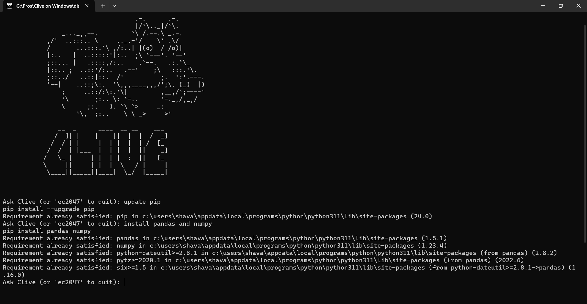

## Clive On Windows
### CLI thats aliVE 


                                    .-.      .-.
                                    |/`\\.._|/`\.
                _..._,,--.         `\ /.--.\ _.-. 
            ,/'  ..:::.. \     .._.-'/    \` .\/ 
            /       ...:::.`\ ,/:..| |(o)  / /o)|
            |:..   |  ..:::::'|:..  ;\ `---'. `--'
            ;::... |   .::::,/:..    .`--.   .:.`\_
            |::.. ;  ..::'/:..   .--'    ;\   :::.`\.
            ;::../   ..::|::.  /'          ;.  ':'.---.
            `--|    ..::;\:.  `\,,,____,,,/';\. (_)  |)
                ;     ..::/:\:.`\|         ,__,/`;----'
                `\       ;:.. \: `-..      `-._,/,_,/
                \      ;:.   ). `\ `>     _:
                    `\,  ;:..    \ \ _>     >'
                    
               __  _      ____  __ __    ___ 
              /  ]| |    |    ||  |  |  /  _]
             /  / | |     |  | |  |  | /  [_ 
            /  /  | |___  |  | |  |  ||    _]
           /   \_ |     | |  | |  :  ||   [_ 
           \     ||     | |  |  \   / |     |
            \____||_____||____|  \_/  |_____|
                                  


Clive is an innovative command line interface (CLI) tool designed to streamline the interaction between users and their Windows machines. By harnessing the capabilities of Gemini AI, Clive enables users to execute various system operations using simple natural language commands.

# Overview

Traditionally, interacting with a command line interface requires users to memorize and input complex commands, which can be daunting for beginners and time-consuming for experienced users. Clive simplifies this process by allowing users to communicate with their system using everyday language, making it more accessible and user-friendly.

## Features

- Interpret natural language commands
- Generate corresponding command line commands
- Execute command line commands on a Windows machine

## Installation

1. Clone the repository:

    ```bash
    git clone https://github.com/HavaleShreyash/Clive-On-Windows.git
    cd clive
    ```

2. Install the required dependencies:

    ```bash
    pip install -r requirements.txt
    ```

3. Configure the Gemini API:

    - Set up a Gemini API key and store it in a `.env` file.
    - Example `.env` file:

        ```
        GEMINI_API_KEY=your_gemini_api_key_here
        ```

## Usage

1. Run the `clive.py` script:

    ```bash
    python clive.py
    ```

2. Enter a natural language command when prompted. For example:

    ```
    Ask Clive (or 'ec2047' to quit): Make a new folder named 'project'
    ```

3. Clive will interpret the command, generate the corresponding command line command, and execute it on your system.

## Example Commands

- Make a new folder named 'project'
- Initialize a new Git repository in the current directory
- List all files in the current directory



## Contributing

Contributions are welcome! If you have any ideas for improvements or new features, feel free to open an issue or submit a pull request.

## License

This project is licensed under the MIT License. See the [LICENSE](LICENSE) file for details.

## Acknowledgements

- Gemini AI for providing powerful natural language processing capabilities.
- Python community for creating useful libraries like `dotenv`, `argparse`, and `google.generativeai`.
